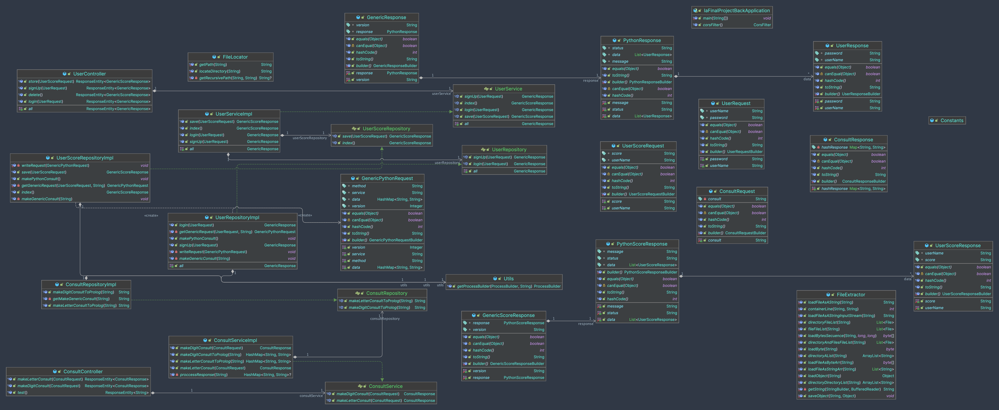
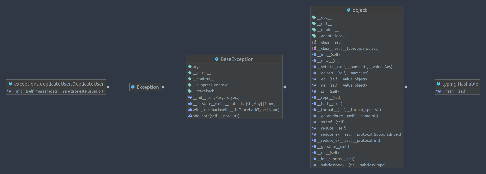
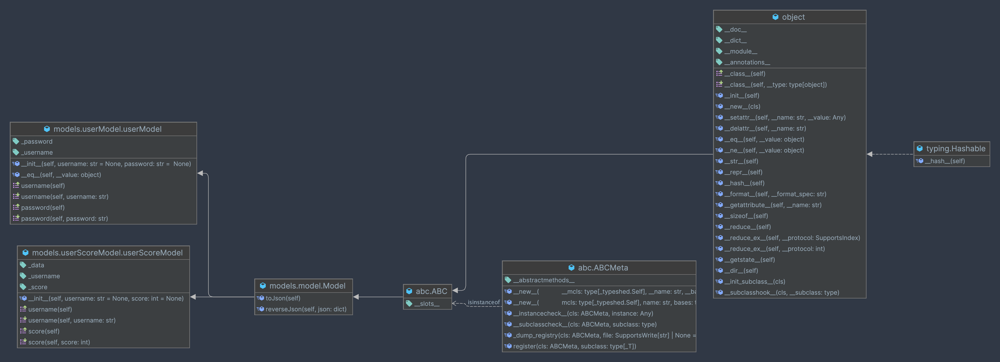
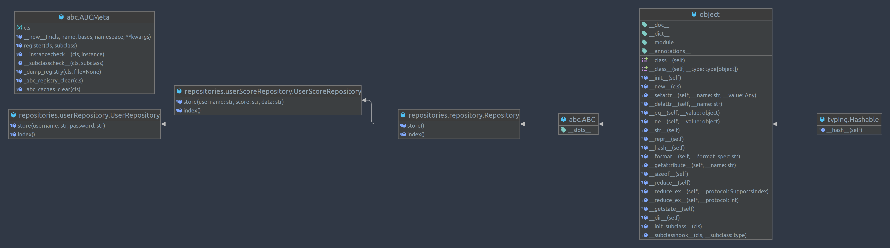
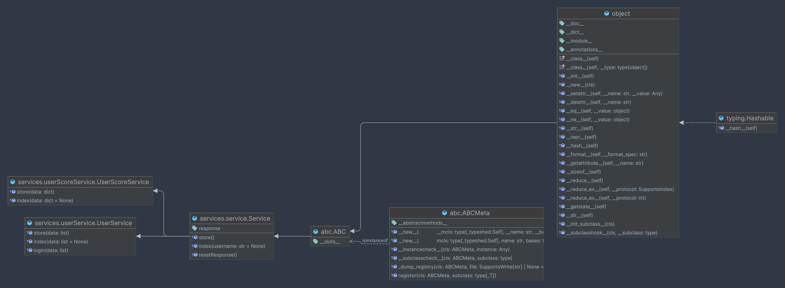

# IA Final Project Backend (Spring boot - Python - Prolog)

## Index of contents

<!-- TOC -->
* [IA Final Project Backend (Spring boot - Python - Prolog)](#ia-final-project-backend-spring-boot---python---prolog)
  * [Index of contents](#index-of-contents)
  * [Description](#description)
    * [Prolog:](#prolog)
    * [Python:](#python)
  * [How to run](#how-to-run)
  * [How to use](#how-to-use)
    * [For translations](#for-translations)
    * [For users](#for-users)
    * [For scores](#for-scores)
  * [How to test](#how-to-test)
  * [How the java-prolog connection works](#how-the-java-prolog-connection-works)
    * [Command examples:](#command-examples)
    * [Explanation:](#explanation)
  * [How the java-python connection works](#how-the-java-python-connection-works)
    * [Command example:](#command-example)
    * [Explanation:](#explanation-1)
  * [How the project is structured](#how-the-project-is-structured)
  * [Diagrams](#diagrams)
    * [Spring Boot - class diagram](#spring-boot---class-diagram)
    * [Python - exception class diagram](#python---exception-class-diagram)
    * [Python - models class diagram](#python---models-class-diagram)
    * [Python - repositories class diagram](#python---repositories-class-diagram)
    * [Python - services class diagram](#python---services-class-diagram)
  * [Requirements](#requirements)
  * [Authors](#authors)
<!-- TOC -->

## Description

This project consists of an application that connects a backend created in Spring Boot with a Prolog and a Python program.

### Prolog:
- Responsible for translating numbers to letters and vice versa.

### Python:
- Responsible for all users methods like: signup, login and the score management.

## How to run

Open the terminal and go to the project folder. Then, run the following command:

```bash
java -jar <project-name>.jar
```

## How to use

This project only works with the following requests:

### For translations

- From digits: 

```
###
POST http://localhost:34545/consult/letter
Content-Type: application/json

{
  "consult": "1002" // or any other number between 0 and 999 999 999
}
```

- From words:

```
###
POST http://0.0.0.0:34545/consult/digit
Content-Type: application/json

{
  "consult": "mil dos" // or any other number between 0 and 999 999 999 in words notation separated by spaces
}
```
### For users

- To sign up:

```
###
POST http://localhost:34545/user/signUp
Content-Type: application/json

{
  "username": "pepe",
  "password": "612812"
}
```

- To login:

```
###
POST http://localhost:34545/user/login
Content-Type: application/json

{
  "username": "pepe",
  "password": "612812"
}
```

- To get all users:

```
###
GET http://localhost:34545/user/getAll
```
### For scores

- To get all scores:

```
###
GET http://localhost:34545/user/score/index
```

- To save the score of a user:

```
###
POST http://localhost:34545/user/score/store
Content-Type: application/json

{
  "username": "pepe",
  "score": "123123"
}
```

## How to test

Open POSTMAN and use the requests above to test the project.

In Intellij, you can create a .http request file in `Scratches and Consoles/Scratches/your_file.http` and add de comands above to test the project.

Later, you can run the tests by clicking in the green arrow next to the request.

## How the java-prolog connection works

The project uses the `ProcessBuilder` class to execute the SWI-Pl command line. The command is executed in the `ConsultRepositoryImpl` class.

The command is executed in the following way:

```java
private String getMakeGenericConsult(String command) {
    var processBuilder = new ProcessBuilder();

    processBuilder = utils.getProcessBuilder(processBuilder, command);

    try {
        var process = processBuilder.start();
        var reader = new BufferedReader(new InputStreamReader(process.getInputStream()));
        String line;
        var response = new StringBuilder();
        while ((line = reader.readLine()) != null) {
            System.out.println(line);
            response.append(line);
        }
        return response.substring(0, response.length() - 1).replace("'", "");
    } catch (Exception e) {
        e.printStackTrace();
    }

    return "error";
}
```

### Command examples:

- For translations from digits to letters:
```zsh
echo "numero(N, 1002)." | swipl -q -f <route-to-numero.pl>/numero.pl
```

- For translations from letters to digits:
```zsh
echo "numeral(L, 'mil dos')." | swipl -q -f <route-to-numeral.pl>/numeral.pl
```
### Explanation:

As you can see, the project runs the command in the system terminal and then reads the output of the command to return the result.

The selection of the terminal to run the command is made by the `System.getProperty("os.name").toLowerCase().contains("win")` condition.
Making this project compatible with Windows and Unix systems.

## How the java-python connection works

It works similarly to connecting with Prolog, but in this case, the commands to run Python are changed.

Here is an example of the signUp method:

```java
 public GenericResponse signUp(UserRequest userRequest) {
        writeRequest(getGenericRequest(userRequest, "store"));
        makePythonConsult();

        GenericResponse response;
        try {
            response = new ObjectMapper().readValue(new File(FileLocator.getPath("response.json")), GenericResponse.class);
        } catch (URISyntaxException | IOException e) {
            throw new RuntimeException(e);
        }
        return response;
    }
```
### Command example:

```zsh
python3 <route-to-app.py>/app.py
```
### Explanation:

The `writeRequest` method writes the request to a file that the Python program will read.

The `makePythonConsult` method runs the Python program.

The `response.json` file is created by the Python program and contains the response of the request.

## How the project is structured

The project is divided into two modules:

- `Spring`: Contains the Spring Boot application.

    Directory structure:
    - src
      - `main/`
        - `java/org/suehay/`
            - `ia_final_project_back`
              - `controller` - contains the controllers
              - `model` - contains the domain models
              - `repository` - contains the connection with: Prolog, Python and .json files
              - `service` - contains the services
              - `utils` - contains the utilities
        - `resources`
          - `application.properties` - contains the application properties

---

- `Python`: Contains the Python program.

    Directory structure:
    - `python_final`
      - `exceptions` - contains the custom exceptions
      - `models` - contains the domain models
      - `repositories` - contains the repositories
      - `services` - contains the services
      - `app.py` - is the main file

## Python project explanation

<!--TODO 3/24/24 palmerodev : eto hay que hacerlo-->

## Prolog project explanation

<!--TODO 3/24/24 palmerodev : eto hay que hacerlo-->

## Diagrams

### Spring Boot - class diagram



### Python - exception class diagram



### Python - models class diagram



### Python - repositories class diagram



### Python - services class diagram



## Requirements

- Java 11 or higher
- SWI-Pl installed on your machine
- Python 3.8 or higher

## Authors

 - [Victor Manuel Palmero Valdes](https://github.com/palmerovicdev)
 - [José Lázaro Díaz Estive](https://github.com/jldestive)
 - [Marcos Sebastian Portales Ramos](https://github.com/marcosportales)